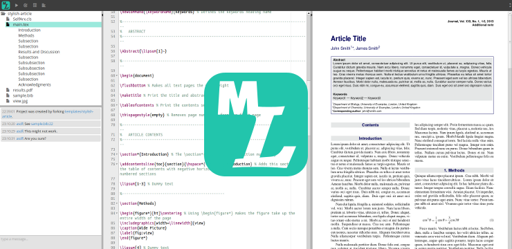

Multilatex
==========

[Multilatex][multilatex] is a collaborative web editor for Latex projects. [Old
demo.][demo]

## Install

Install dependencies:

    npm install

Install Gulp globaly:

    sudo npm install -g gulp

Download [Vagrant][vagrant].

Go to the `machines` dir and bring up them up. This will take a long while the
first time.

    cd machines
    vagrant up

Configure passwordless SSH for `root` and `vagrant` users for easy access:

    gulp ssh-copy-id -i ~/.ssh/id_rsa.pub root@10.10.10.11

Build the project:

    gulp

Or for the production mode use:

    gulp --production

Deploy to the running VM:

    gulp dev-deploy

Follow the logs (doesn't end):

    gulp dev-log

Recreate the templates (optional):

    gulp dev-templates

Now go to [10.10.10.11](http://10.10.10.11).

## DO Deployment

    vagrant plugin install vagrant-digitalocean
    vagrant up --provider=digital_ocean

## License

MIT

[multilatex]: http://multilatex.com
[demo]: https://www.youtube.com/watch?v=8zAGN35_GpY
[vagrant]: https://www.vagrantup.com/downloads.html
